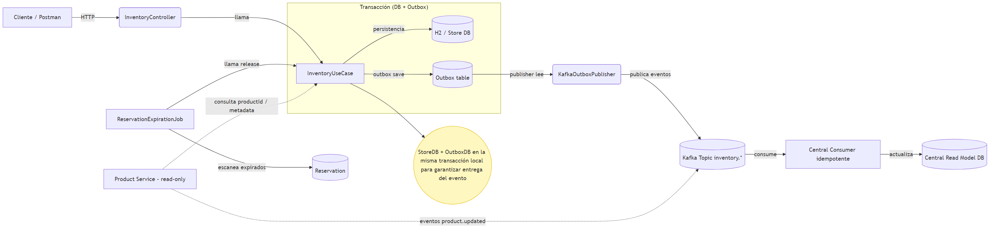

# Inventory Service

## Resumen Arquitectónico

Servicio de inventario implementado con arquitectura hexagonal (ports & adapters) que gestiona reservas de stock con consistencia optimista. Utiliza el patrón Outbox para publicar eventos de forma confiable a Kafka, garantizando la consistencia eventual entre la base de datos y los mensajes. El servicio maneja concurrencia mediante versioning optimista y retries, y expone una API REST para reservar, confirmar y liberar inventario.

## Levantar el Servicio

### 1. Iniciar Kafka

```bash
# Iniciar servicios
docker-compose up -d

# Verificar que están corriendo
docker-compose ps
```

### 2. Iniciar la Aplicación

```bash
./mvnw spring-boot:run
```

## API Documentation

La documentación OpenAPI está disponible en:

- Swagger UI: http://localhost:8080/swagger-ui.html
- OpenAPI JSON: http://localhost:8080/v3/api-docs

### Ejemplos de Uso

#### 1. Crear Reserva

```bash
curl --location 'http://localhost:8080/inventory/reserve' \
--header 'Content-Type: application/json' \
--data '{
  "storeId": "store-001",
  "productId": "sku-100",
  "quantity": 2,
  "transactionId": "tx-123"
}'

# Respuesta Exitosa:
{
  "reservationId": "550e8400-e29b-41d4-a716-446655440000",
  "status": "PENDING",
  "expiresAt": "2024-01-24T12:34:56.789Z"
}
```

#### 2. Confirmar Reserva

```bash
curl --location --request POST 'http://localhost:8080/inventory/commit?reservationId=550e8400-e29b-41d4-a716-446655440000'

# Respuesta: 200 OK
```

#### 3. Liberar Reserva

```bash
curl --location --request POST 'http://localhost:8080/inventory/release' \
--header 'Content-Type: application/json' \
--data '{
  "reservationId": "550e8400-e29b-41d4-a716-446655440000",
  "reason": "customer_cancelled"
}'

# Respuesta: 200 OK
```

#### 4. Consultar Inventario

```bash
curl --location 'http://localhost:8080/inventory'

# Respuesta:
[
  {
    "storeId": "store-001",
    "productId": "sku-100",
    "totalQuantity": 100,
    "reservedQuantity": 2,
    "available": 98
  }
]
```

### Manejo de Errores

#### Stock Insuficiente

```json
{
  "message": "Insufficient stock: Available: 5, Requested: 10"
}
```

#### Producto No Encontrado

```json
{
  "message": "Product not found"
}
```

## Monitoreo

### Métricas Disponibles

- `inventory_reservations_total`: Total de reservas creadas
- `inventory_reservation_duration_seconds`: Duración de las reservas
- `inventory_stock_level`: Nivel actual de stock por producto

### Logs Importantes

```log
2024-01-24 12:34:56 INFO  Created reservation id=xxx, transactionId=yyy
2024-01-24 12:34:57 INFO  Committed reservation id=xxx
2024-01-24 12:34:58 WARN  Insufficient stock for reservation
```

## Trade-offs y Decisiones

1. **Consistencia Eventual vs Fuerte**:

   - Se eligió consistencia eventual para el checkout usando el patrón Outbox
   - Beneficio: mejor disponibilidad y escalabilidad
   - Costo: ventana de inconsistencia temporal

2. **Optimistic Locking**:

   - Versioning optimista en lugar de locks pesimistas
   - Beneficio: mejor concurrencia y throughput
   - Costo: retries ocasionales

3. **In-Memory Database**:
   - H2 para prototipado rápido
   - Trade-off: simplicidad vs durabilidad

## Limitaciones y Próximos Pasos

### Limitaciones Actuales

- Sin persistencia durable (H2 in-memory)
- Manejo básico de errores
- Sin métricas detalladas
- Testing limitado

### Próximos Pasos

1. Migrar a PostgreSQL
2. Añadir circuit breakers
3. Implementar métricas Prometheus
4. Ampliar test coverage
5. Añadir rate limiting
6. Documentación OpenAPI
7. Logging estructurado
8. Healthchecks más robustos

## Documentación Técnica

### Diagramas de Arquitectura

Los diagramas se generan usando [Mermaid CLI](https://github.com/mermaid-js/mermaid-cli). Para generar los diagramas:

1. Instalar mermaid-cli globalmente:

```bash
npm install -g @mermaid-js/mermaid-cli
```

2. Generar el diagrama:

```bash
# Desde el directorio docs/
mmdc -i architecture-diagram.mmd -o architecture-diagram.png
```

El diagrama de arquitectura muestra:

- Flujo de requests HTTP
- Procesamiento de comandos
- Publicación de eventos vía Outbox pattern
- Job de expiración de reservas


 - Flujos de interacción principales


Los otros diagramas incluyen:

- [Event Flow](docs/event-flow.png) - Flujo de eventos entre servicios
- [Data Model](docs/data-model.png) - Modelo de datos y relaciones

## Prompts IA

Los prompts utilizados para el desarrollo están documentados en [prompts-used.txt](./prompts-used.txt)
